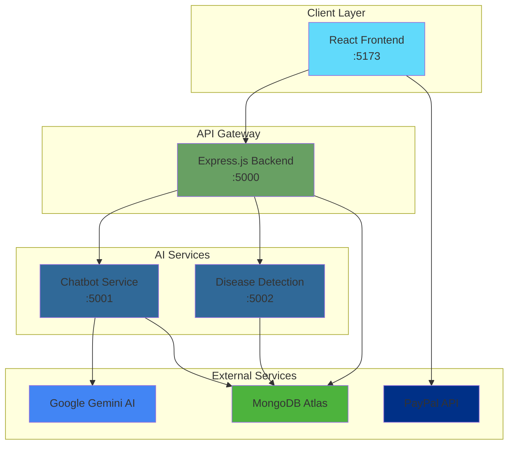
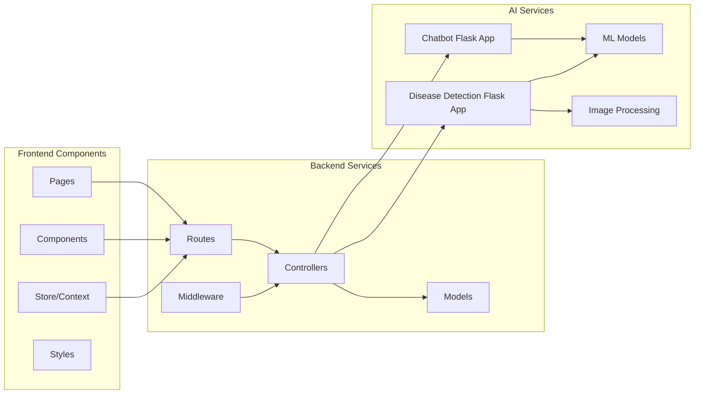
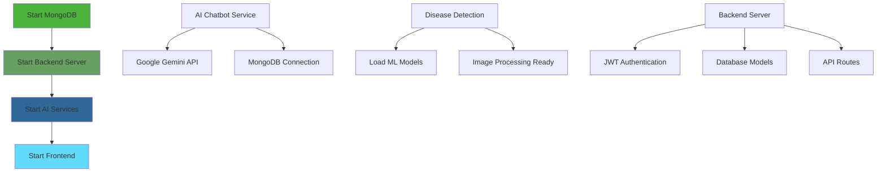
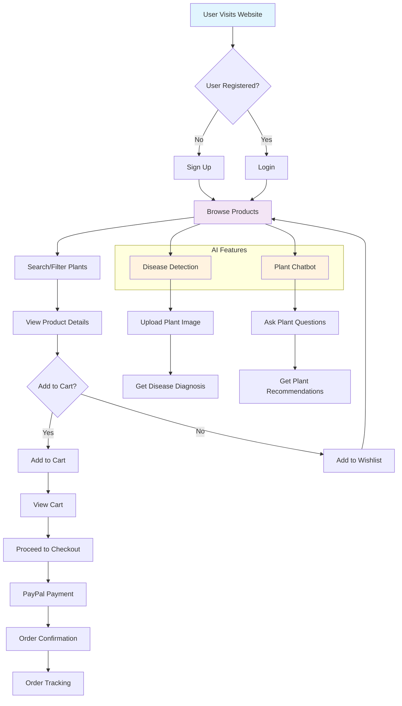
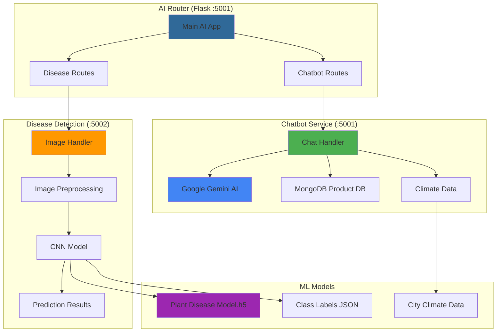
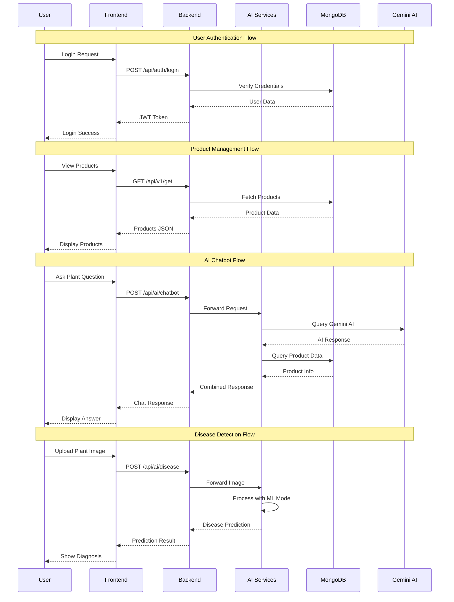
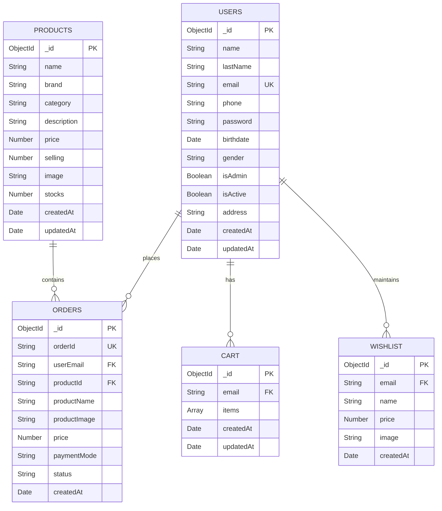
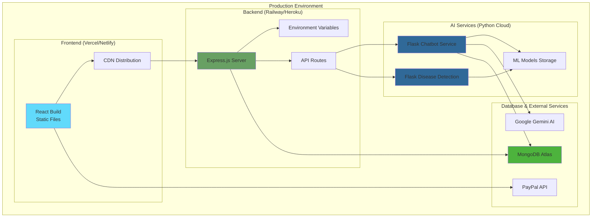

# GreenHaven 🌱

A comprehensive e-commerce platform for plants with integrated AI services for plant disease detection and intelligent chatbot assistance.

## 🌟 Features

- **E-commerce Platform**: Complete online store for plant products
- **AI Plant Disease Detection**: Upload plant images to detect diseases using deep learning
- **Intelligent Chatbot**: Get plant recommendations based on location and climate
- **User Management**: Authentication, user profiles, and order tracking
- **Admin Dashboard**: Product management, order management, and user analytics
- **Cart & Wishlist**: Full shopping experience with cart and wishlist functionality
- **PayPal Integration**: Secure payment processing
- **Responsive Design**: Mobile-friendly UI with modern styling

## 🏗️ Architecture

The application follows a microservices architecture with three main components:

### System Overview



### Component Architecture



### 1. Frontend (React + Vite)

- **Framework**: React 18 with Vite for fast development
- **Styling**: Tailwind CSS + Chakra UI for modern, responsive design
- **State Management**: Zustand for global state management
- **Routing**: React Router for client-side navigation
- **Icons**: React Icons for consistent iconography

### 2. Backend (Node.js + Express)

- **Framework**: Express.js with MongoDB integration
- **Database**: MongoDB with Mongoose ODM
- **Authentication**: JWT-based authentication with bcrypt
- **API Routes**: RESTful APIs for products, users, cart, orders, and wishlist
- **Middleware**: CORS, authentication, and admin verification

### 3. AI Services (Python + Flask)

- **Disease Detection**: TensorFlow/Keras model for plant disease classification
- **Chatbot**: Google Gemini AI integration for plant recommendations
- **Image Processing**: PIL for image preprocessing
- **Climate Data**: Location-based climate recommendations

## 🛠️ Tech Stack

### Frontend

- React 18
- Vite
- Tailwind CSS
- Chakra UI
- React Router
- Axios
- React Icons
- React Toastify
- React Slick (Carousel)
- PayPal React SDK

### Backend

- Node.js
- Express.js
- MongoDB
- Mongoose
- JWT
- bcryptjs
- CORS
- dotenv
- UUID

### AI Services

- Python 3.x
- Flask
- TensorFlow/Keras
- Google Generative AI (Gemini)
- Pillow (PIL)
- NumPy
- NLTK
- PyMongo

## 📋 Prerequisites

Before running the application, ensure you have:

- Node.js (v16 or higher)
- Python (v3.8 or higher)
- MongoDB (local or cloud instance)
- npm or yarn package manager

## 🚀 Installation & Setup

### 1. Clone the Repository

```bash
git clone https://github.com/krishnan1235/e-commerse-Greenhaven.git
cd e-commerse-Greenhaven
```

### 2. Setup Frontend

```bash
cd frontend
npm install
```

### 3. Setup Backend

```bash
cd backend
npm install
```

### 4. Setup AI Services

```bash
cd ai_services
pip install -r requirements.txt
```

### 5. Environment Variables

Create `.env` files in the respective directories:

#### Backend (.env)

```env
MONGO=your_mongodb_connection_string
JWT_SECRET=your_jwt_secret_key
PORT=5000
```

#### AI Services (Optional - if using custom API keys)

```env
GENAI_API_KEY=your_google_gemini_api_key
MONGO_URI=your_mongodb_connection_string
```

## 🏃‍♂️ Running the Application

### Service Dependencies



### Start all services:

1. **Frontend Development Server**

```bash
cd frontend
npm run dev
```

Access at: `http://localhost:5173`

2. **Backend Server**

```bash
cd backend
npm run dev
```

Runs on: `http://localhost:5000`

3. **AI Services**

```bash
cd ai_services
python app.py
```

Runs on: `http://localhost:5001`

4. **Disease Detection Service**

```bash
cd ai_services/disease_detection
python app.py
```

Runs on: `http://localhost:5002`

## 📁 Project Structure

```
e-commerse-Greenhaven/
├── frontend/                 # React frontend application
│   ├── src/
│   │   ├── components/      # Reusable UI components
│   │   ├── pages/           # Main application pages
│   │   ├── store/           # State management
│   │   └── styles/          # CSS styling files
│   ├── public/              # Static assets
│   └── package.json
├── backend/                 # Express.js backend
│   ├── config/             # Database configuration
│   ├── controllers/        # Route controllers
│   ├── middleware/         # Authentication & validation
│   ├── models/             # MongoDB schemas
│   ├── routes/             # API routes
│   └── server.js           # Main server file
├── ai_services/            # Python AI services
│   ├── chatbot/            # Chatbot service
│   ├── disease_detection/  # Disease detection service
│   │   └── model/          # ML model files
│   └── app.py              # Main AI router
└── README.md
```

## 🔑 Key Features Explained

### User Journey Flow



### AI Service Architecture



### 1. E-commerce Functionality

- **Product Catalog**: Browse plants by categories (Indoor, Outdoor, Medicinal, etc.)
- **Search & Filter**: Smart search with real-time filtering
- **Product Details**: Detailed product pages with images and descriptions
- **Shopping Cart**: Add/remove items with quantity management
- **Wishlist**: Save favorite products for later
- **Order Management**: Track orders from placement to delivery

### 2. AI-Powered Features

- **Disease Detection**:
  - Upload plant images for disease diagnosis
  - Uses trained CNN model for accurate predictions
  - Provides top 3 predictions with confidence scores
- **Plant Chatbot**:
  - Get plant recommendations based on location and climate
  - Price queries for specific plants
  - General plant care advice using Google Gemini AI

### 3. User Management

- **Authentication**: Secure login/registration with JWT tokens
- **User Profiles**: Manage personal information and addresses
- **Order History**: View past orders and track status
- **Admin Panel**: Comprehensive dashboard for store management

### 4. Payment Integration

- **PayPal Integration**: Secure payment processing
- **Order Confirmation**: Email confirmations and order tracking
- **Multiple Payment Options**: Support for various payment methods

## 🎯 API Endpoints

### API Flow Diagram



### Products

- `GET /api/v1/get` - Get all products
- `POST /api/v1/add` - Add new product (Admin)
- `PUT /api/v1/update/:id` - Update product (Admin)
- `DELETE /api/v1/delete/:id` - Delete product (Admin)

### Authentication

- `POST /api/auth/register` - User registration
- `POST /api/auth/login` - User login
- `POST /api/auth/logout` - User logout
- `GET /api/auth/users` - Get all users (Admin)

### Cart & Wishlist

- `POST /api/cart/add` - Add to cart
- `GET /api/cart/:email` - Get cart items
- `DELETE /api/cart/:email/:productId` - Remove from cart
- `POST /api/wishlist/add` - Add to wishlist
- `GET /api/wishlist/:email` - Get wishlist items

### AI Services

- `POST /api/ai/chatbot` - Chat with AI assistant
- `POST /api/ai/disease` - Plant disease detection

## 🔐 Security Features

- **JWT Authentication**: Secure token-based authentication
- **Password Hashing**: bcrypt for password security
- **Admin Verification**: Role-based access control
- **CORS Configuration**: Proper cross-origin resource sharing
- **Input Validation**: Server-side validation for all inputs

## 🎨 UI/UX Features

- **Modern Design**: Clean, modern interface with Chakra UI
- **Responsive Layout**: Mobile-first design approach
- **Loading States**: Smooth loading indicators
- **Toast Notifications**: User-friendly feedback messages
- **Carousel Components**: Interactive product showcases
- **Floating Chatbot**: Accessible AI assistance

## 📊 Database Schema

### Entity Relationship Diagram



### Database Collections

#### Products

- name, brand, category, description, price, image, stocks, selling status

#### Users

- name, email, password, phone, address, orders, authentication status

#### Orders

- orderId, userEmail, productInfo, price, paymentMode, status, timestamps

#### Cart Items

- email, items (name, price, image, quantity)

#### Wishlist Items

- email, name, price, image, timestamps

## 🚦 Development Guidelines

### Frontend Development

- Use functional components with hooks
- Implement proper error handling
- Follow React best practices
- Use TypeScript for type safety (optional)

### Backend Development

- Follow RESTful API conventions
- Implement proper error handling
- Use middleware for authentication
- Follow MVC pattern

### AI Services

- Use proper image preprocessing
- Implement error handling for AI services
- Cache frequently used data
- Follow Python best practices

## 📈 Performance Optimizations

- **Image Optimization**: Optimized image loading and caching
- **Code Splitting**: Lazy loading of components
- **Database Indexing**: Proper MongoDB indexing
- **Caching**: Client-side and server-side caching strategies
- **Compression**: Gzip compression for API responses

## 🔧 Deployment

### Deployment Architecture



### Deployment Steps

### Frontend Deployment (Vercel/Netlify)

```bash
cd frontend
npm run build
# Deploy dist folder
```

### Backend Deployment (Railway/Heroku)

```bash
cd backend
# Set environment variables
# Deploy to cloud platform
```

### AI Services Deployment

```bash
cd ai_services
# Deploy to cloud platform with Python support
```

## 🤝 Contributing

1. Fork the repository
2. Create a feature branch
3. Make your changes
4. Submit a pull request

### Issues

Please report issues on the GitHub repository with:

- Clear description of the problem
- Steps to reproduce
- Expected vs actual behavior
- Screenshots if applicable

### Contributing

1. Fork the repository
2. Create a feature branch
3. Make your changes
4. Submit a pull request

## 📄 License

This project is licensed under the MIT License - see the LICENSE file for details.

## 🙏 Acknowledgments

- TensorFlow team for the machine learning framework
- Google for the Gemini AI API
- MongoDB for the database solution
- React and Node.js communities for excellent documentation
- All contributors and testers

---

**GreenHaven** - _Growing a greener future with AI-powered plant care_ 🌿
